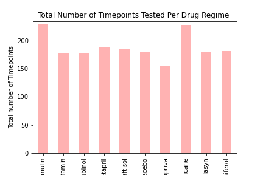
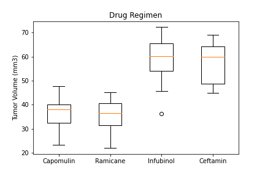
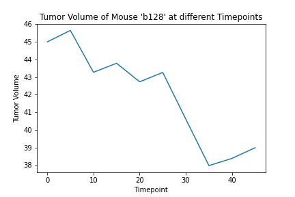
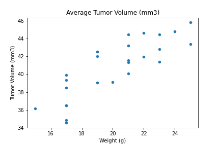
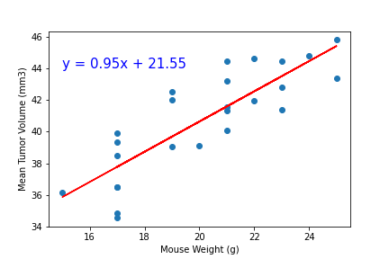

# Using Matplotlip and Pandas to analyze pharmaceutical study result
## Health data analysis

This analysis shows the relation between several drug treatments and tumor volume in mice. According to the results Capomulin and Ramicane were the most effective drugs in shrinking the tumor volume in mice tested. Infubinol, and Ceftamin were not as effective as capomulin and Ramicane in shrinking the tumor volume in mice tested. There seems to be a pozitive correlation between Mouse weight and average tumor volume Naftisol and Stelasyn had effects similar to placebo, making them the least effective drugs amongst the drugs that were studied in this research.

### The Jupyter notebook shows

1. The data cleaning, i.e. removal of duplicates rows from the df.

1. Summary statistics for Tumor volume per drug regimen.

1. Bar charts showing total number of timepoints for all mice tested for each drug regimen by using 2 different methods. 

1. Boxplot showing Tumor volumes in Capomulin, Ramicane, Infubinol and Ceftamin treated mice. 

1. Line plot showing tumor volume vs. time point for one mouse treated with Capomulin.

1. A scatter plot of average tumor volume vs. mouse weight for the Capomulin regimen.

1. A linear regression model for mouse weight and average tumor volume for the Capomulin regimen and the R square value and correlation cofficient.

